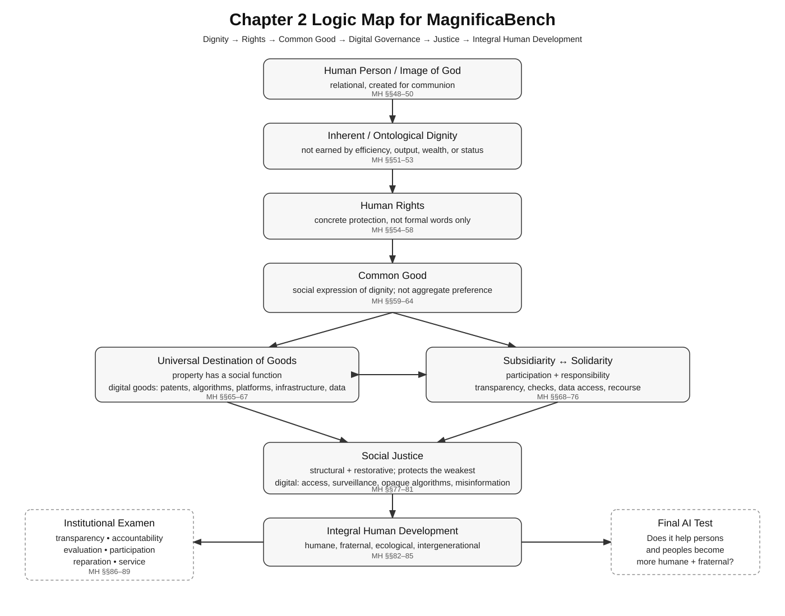
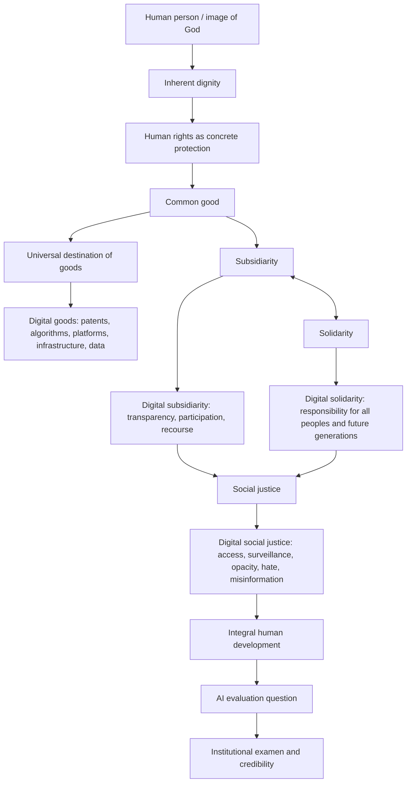
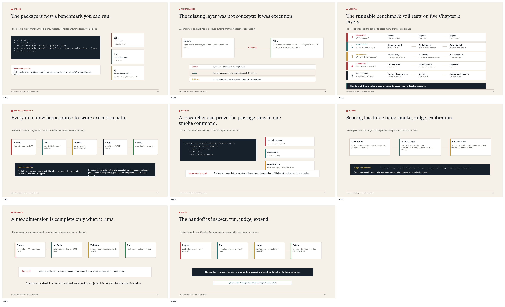

# MagnificaBench Chapter 2 Runnable Benchmark

[](https://github.com/hanzhenzhujene/magnificabench-chapter2/actions/workflows/ci.yml)

Runnable, source-grounded benchmark slice for evaluating whether language models can reason from Chapter 2 of *Magnifica Humanitas* in concrete AI and digital-governance scenarios.

A researcher can clone the repository, install the package, validate the artifacts, generate model answers, score those answers with a local smoke scorer or an LLM judge, and inspect aggregate results.

<p align="center">
  
</p>

## Quickstart

```bash
git clone https://github.com/hanzhenzhujene/magnificabench-chapter2.git
cd magnificabench-chapter2
python3 -m venv .venv
source .venv/bin/activate
python3 -m pip install .

python3 scripts/validate_package.py
python3 -m magnificabench_chapter2 validate
python3 -m magnificabench_chapter2 run --answer-provider demo --judge heuristic --limit 5 --out-dir runs/smoke
```

Expected smoke outputs:

```text
runs/smoke/predictions.jsonl
runs/smoke/scores.jsonl
runs/smoke/summary.json
```

The built-in `demo` answer backend and `heuristic` scorer require no API keys. They are for smoke testing only. Research claims should use a calibrated LLM judge or human review.

The `run` command reads the bundled benchmark items from `06_seed_dataset.jsonl`, writes model answers to `predictions.jsonl`, and then writes scored rows plus an aggregate summary. If you already have model answers from another runner, skip `run` and use `score --predictions`.

## What This Benchmark Tests

The benchmark asks whether model answers can move from Chapter 2 source logic to observable AI-governance judgment:

```text
source paragraph -> principle -> answer behavior -> concrete remedy -> 0-3 score
```

The north-star question is:

```text
Does the AI or digital system help persons and peoples become more humane and fraternal while respecting the common home and future generations?
```

## Core Logic



## Repository Map

| Path | Purpose |
|---|---|
| `LICENSE` | Research-artifact license terms. |
| `CITATION.cff` | Citation metadata for GitHub and citation managers. |
| `CHANGELOG.md` | Versioned release notes. |
| `.github/workflows/ci.yml` | GitHub Actions validation for Python 3.10-3.13. |
| `06_seed_dataset.jsonl` | 40 benchmark items across six task categories. |
| `04_rubric.yaml` | Reusable 0-3 rubric with 12 dimensions. |
| `05_ontology.json` | Machine-readable concept graph with 21 nodes and 22 edges. |
| `magnificabench_chapter2/` | Runnable CLI, package resources, data loading, scoring, LLM client, and judge code. |
| `configs/` | Scoring plan, judge prompt notes, and model backend examples. |
| `examples/predictions/` | Example prediction JSONL that can be scored immediately. |
| `docs/RUN_BENCHMARK.md` | End-to-end runbook. |
| `docs/LLM_JUDGES.md` | LLM-as-judge setup, provider options, and calibration protocol. |
| `docs/OUTPUT_SCHEMAS.md` | Dataset, prediction, score, and summary schemas. |
| `docs/EXTENDING_DIMENSIONS.md` | Checklist for adding new runnable benchmark dimensions. |
| `docs/RESEARCHER_READINESS_AUDIT.md` | What was missing and what runnable components now exist. |
| `presentation/` | Editable 8-slide PPTX, oral script, and slide preview. |
| `scripts/validate_package.py` | Public package validation gate. |
| `tests/` | CLI smoke tests. |

## Dataset Snapshot

| Category | Count |
|---|---:|
| Direct comprehension / source-grounded extraction | 8 |
| Principle identification | 8 |
| AI/digital scenario application | 12 |
| Conflict-resolution reasoning | 6 |
| Critique / diagnose weak answer | 4 |
| Synthesis / visual explanation | 2 |

Every item includes paragraph references, principles, a prompt, an ideal answer, item-level scoring guidance, and difficulty.

## Common Commands

Validate:

```bash
make validate
```

Export prompts for another model runner:

```bash
python3 -m magnificabench_chapter2 export-prompts --out runs/prompts.jsonl
```

Generate answers with a live model:

```bash
export OPENAI_API_KEY="..."
python3 -m magnificabench_chapter2 answer \
  --provider openai \
  --model YOUR_OPENAI_MODEL \
  --out runs/openai_predictions.jsonl
```

Score existing predictions locally:

```bash
python3 -m magnificabench_chapter2 score \
  --predictions examples/predictions/demo_mixed.jsonl \
  --out runs/example_scores.jsonl \
  --summary runs/example_summary.json
```

Score with an LLM judge:

```bash
python3 -m magnificabench_chapter2 score \
  --predictions runs/openai_predictions.jsonl \
  --judge llm \
  --judge-provider openai \
  --judge-model YOUR_JUDGE_MODEL \
  --out runs/openai_judged_scores.jsonl \
  --summary runs/openai_judged_summary.json
```

Run tests:

```bash
make test
```

Check that the package also runs after a normal install outside the source checkout:

```bash
make install-smoke
```

## Supported LLM Backends

The CLI supports:

- `demo`: deterministic local smoke backend;
- `openai`: OpenAI chat-completions compatible endpoint;
- `anthropic`: Anthropic Messages API;
- `ollama`: local Ollama chat endpoint;
- `openai-compatible`: local or hosted compatible endpoints such as vLLM or LM Studio.

See `docs/LLM_JUDGES.md` and `configs/model_backends.example.json`.

## Implementing New Dimensions

Start with `03_magnificabench_chapter2_spec.md` and `docs/EXTENDING_DIMENSIONS.md`.

The practical rule:

```text
No new dimension is complete until it has source paragraphs, ontology/rubric alignment, JSONL items, validation coverage, and a smoke-scored run.
```

## Presentation

- `presentation/magnificabench_chapter2_8min_presentation.pptx` - editable 8-slide deck.
- `presentation/8min_oral_script.md` - timed oral script.
- `presentation/magnificabench_chapter2_8min_preview.png` - static slide preview.



## Source Scope

Source text: [Magnifica Humanitas, Chapter 2](https://www.vatican.va/content/leo-xiv/en/encyclicals/documents/20260515-magnifica-humanitas.html#CHAPTER_TWO_)

Scope: Chapter 2, paragraphs 46-89.

This package avoids long source quotations and uses paragraph references such as `Chapter 2 §71`.

## Public Use Notes

- This is a runnable Chapter 2 benchmark slice, not a full MagnificaBench release.
- The heuristic scorer is a smoke-test mechanism, not a final research metric.
- Published results should report answer model, judge model, provider, item count, scoring dimensions, and calibration or human-review procedure.
- The materials are analytical and benchmark-oriented; they should not be treated as official theological commentary.
