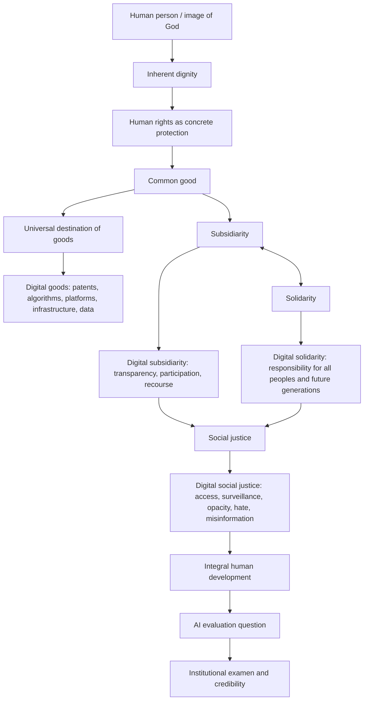

# MagnificaBench Chapter 2 Context Package

Public, source-grounded context package for turning Chapter 2 of *Magnifica Humanitas* into a MagnificaBench benchmark slice.

This repository is built to help a researcher or coding agent implement new benchmark dimensions directly from the included specification, rubric, ontology, seed dataset, and presentation materials.

<p align="center">
  
</p>

## At A Glance

| Artifact | Purpose |
|---|---|
| [`00_CODEX_GOAL.md`](00_CODEX_GOAL.md) | Full generation brief for a polished Chapter 2 deliverable. |
| [`01_chapter2_logic_brief.md`](01_chapter2_logic_brief.md) | Source-grounded conceptual flow from dignity to integral human development. |
| [`02_principle_matrix.md`](02_principle_matrix.md) | Principle-by-principle map from Chapter 2 to benchmark behavior. |
| [`03_magnificabench_chapter2_spec.md`](03_magnificabench_chapter2_spec.md) | Main implementation contract for benchmark categories, dimensions, schemas, and extension workflow. |
| [`04_rubric.yaml`](04_rubric.yaml) | Reusable 0-3 scoring rubric with 12 dimensions. |
| [`05_ontology.json`](05_ontology.json) | Machine-readable concept graph with nodes and edges. |
| [`06_seed_dataset.jsonl`](06_seed_dataset.jsonl) | 40 seed benchmark items across six task categories. |
| [`07_visual_logic_map.mmd`](07_visual_logic_map.mmd) / [`07_visual_logic_map.svg`](07_visual_logic_map.svg) | Mermaid source and rendered visual map. |
| [`08_10min_update_outline.md`](08_10min_update_outline.md) | Speaking outline for a 10-15 minute team update. |
| [`chapter2_slide_outline.md`](chapter2_slide_outline.md) | Optional slide skeleton. |
| [`scripts/validate_package.py`](scripts/validate_package.py) | Local package validation script. |

## Core Logic



## Dataset Snapshot

The seed dataset contains 40 valid JSONL items:

| Category | Count |
|---|---:|
| Direct comprehension / source-grounded extraction | 8 |
| Principle identification | 8 |
| AI/digital scenario application | 12 |
| Conflict-resolution reasoning | 6 |
| Critique / diagnose weak answer | 4 |
| Synthesis / visual explanation | 2 |

Every item includes paragraph references, principles, an ideal answer, item-level scoring guidance, and difficulty.

## Implementing New Dimensions

Start with [`03_magnificabench_chapter2_spec.md`](03_magnificabench_chapter2_spec.md). It defines:

- the dimension implementation contract;
- the existing dimension registry;
- the workflow for adding a new dimension;
- ontology and rubric templates;
- JSONL item schema and allowed values;
- a worked example for `worker_participation_in_ai_deployment`;
- validation checks before release.

The most important rule: every new dimension must connect a Chapter 2 source claim to observable model-answer behavior, 0-3 scoring criteria, and concrete benchmark items.

## Validate The Package

Run:

```bash
python3 scripts/validate_package.py
```

The validator checks:

- all expected artifacts exist;
- the JSONL dataset has 40 valid rows;
- every row has required fields and paragraph references in 46-89;
- the ontology has required nodes and edges;
- the rubric has the required 12 dimensions and levels 0-3;
- README visual assets are present;
- no obvious secret-like strings are present in public-facing files.

## Source Scope

Source text: [Magnifica Humanitas, Chapter 2](https://www.vatican.va/content/leo-xiv/en/encyclicals/documents/20260515-magnifica-humanitas.html#CHAPTER_TWO_)

Scope: Chapter 2, paragraphs 46-89.

This package avoids long source quotations and uses paragraph references such as `Chapter 2 §71`.

## Public Use Notes

- This is a context and implementation package, not a final benchmark release.
- The seed items are designed to be extended and converted into a fuller benchmark module.
- The materials are analytical and benchmark-oriented; they should not be treated as official theological commentary.
